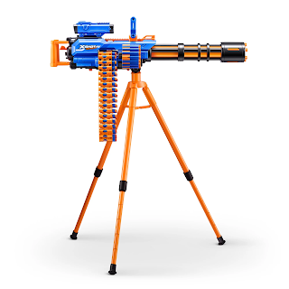
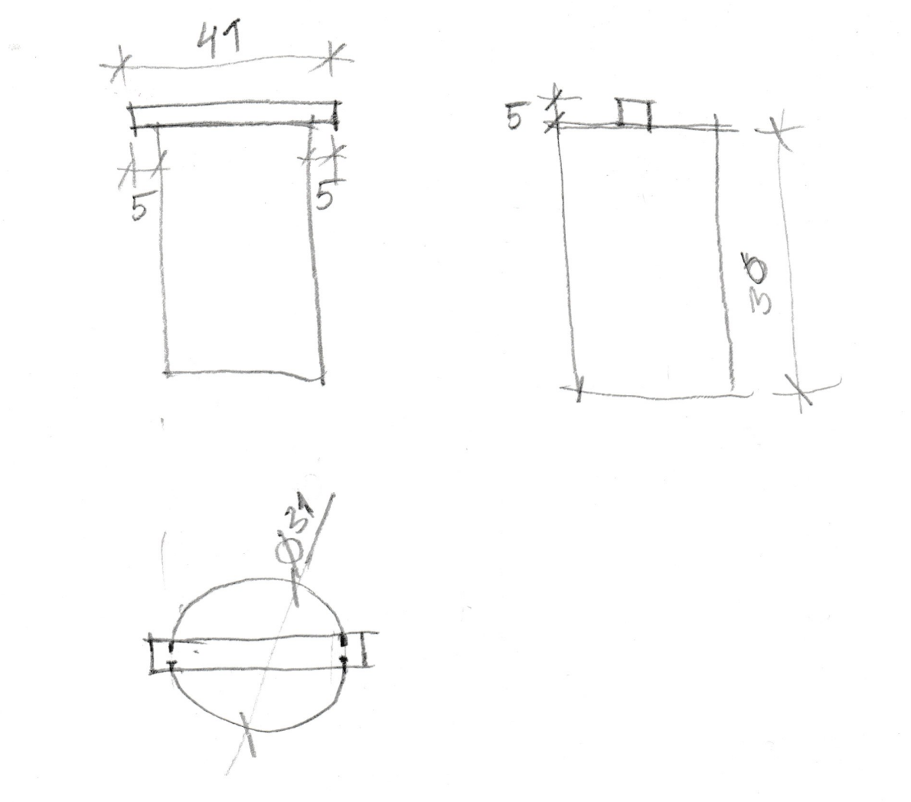
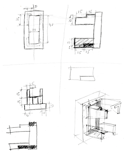
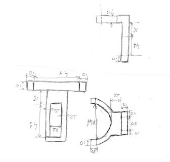
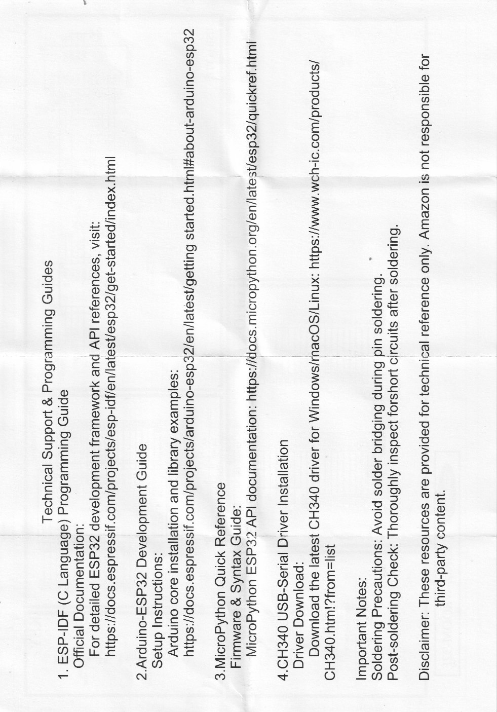
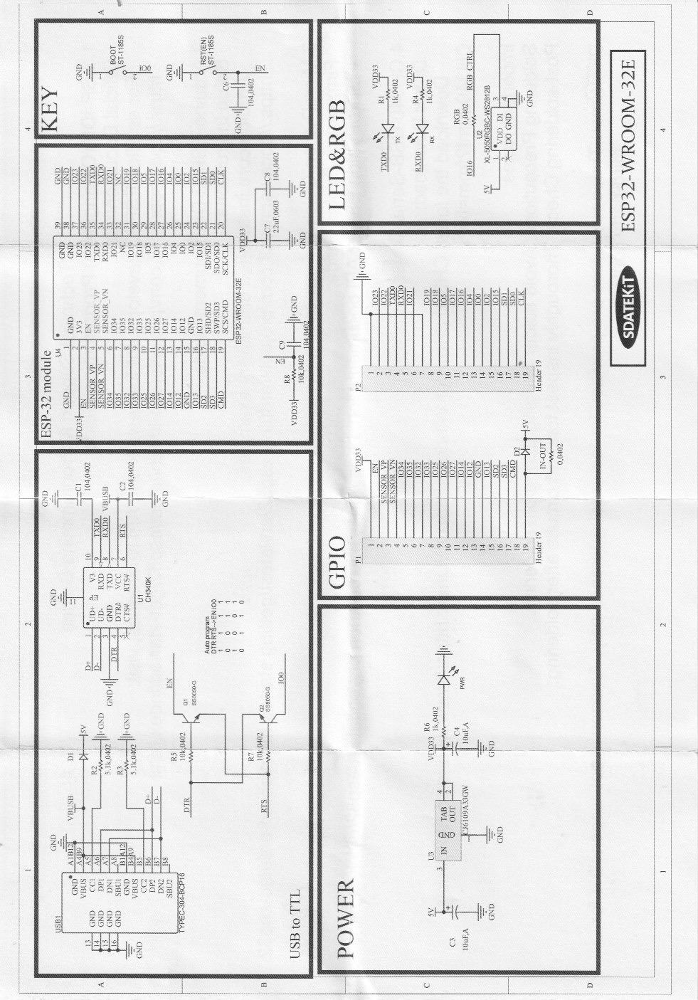

# Auto-Targeting Toy Gun Turret

## Project Overview

My kid had an idea for a project. He proposed to put a targeting system on a toy automatic gun. The targeting system uses an infrared camera that looks for targets. As soon as somebody appears in the camera, the gun should move towards the target and start shooting.

## Toy Selection

We went to Walmart and after some search we found what we need. Here is the gun we chose for our project:



## Project Implementation Idea

We decided to use 2 servo motors for moving the gun:
- **Horizontal servo**: Moves the gun left/right (horizontal rotation)
- **Vertical servo**: Moves the gun up/down (vertical tilt)

**Control System:**
- Infrared camera mounted on the aim for target detection
- Servos mounted on tripod to move the gun
- Relay to control trigger press
- ESP32 microcontroller for control

## 3D Printed Parts

To mount servos to the tripod we need to print 3 models:

### 1. Horizontal Rotation Cylinder
This cylinder will rotate the gun horizontally:



### 2. Bottom Servo Mount
This will be used to mount the servo to the bottom of the gun. The cylinder will rotate the gun:



### 3. Vertical Servo Mount
This will mount another servo to move the gun vertically:



## Hardware Components

### Core Components

| Component | Description | Link |
|-----------|-------------|------|
| **Toy Gun** | XSHOT Insanity Motorized Rage Fire | [Walmart](https://www.walmart.com/ip/ZURU-X-Shot-Insanity-Motorized-Rage-Fire-72-Darts-for-Ages-8-up/1938663272) |
| **IR Camera** | AMG8833 IR 8×8 Thermal Imager Array Temperature Sensor Module | [AliExpress (search)](https://www.aliexpress.us/w/wholesale--AMG8833-IR-8*8-Thermal-Imager-Array-Temperature-S.html) |
| **Servo Motors** | Dsservo Waterproof Servo DS3235 35KG (×2) | [AliExpress](https://www.aliexpress.us/item/3256806768116991.html) |
| **Relay Module** | DC 5V 12V 24V Relay Module with Optocoupler | [AliExpress](https://www.aliexpress.us/item/3256806674677389.html) |

### Electronics & Power

| Component | Description | Amazon Link |
|-----------|-------------|-------------|
| **ESP32 DevKit** | 2×ESP32-WROOM-32E Module USB-C 4MB | [Amazon B0D6BH4K9B](https://www.amazon.com/dp/B0D6BH4K9B) |
| **ESP32-CAM** | 2×ESP32-CAM with OV2640 Camera + MB Programmer Board | [Amazon B0948ZFTQZ](https://www.amazon.com/dp/B0948ZFTQZ) |
| **FTDI Adapter** | FT232RL USB-C to TTL Serial Converter 3.3V/5V 6Pin | [Amazon B0CQVB6JFV](https://www.amazon.com/dp/B0CQVB6JFV) |
| **Buck Converter (×2)** | DROK Mini 5pcs DC 4.5-20V to 5V 3A 10W Adjustable/Fixed | [Amazon B096RC71DC](https://www.amazon.com/dp/B096RC71DC) |
| **Diode** | 1N5819 Schottky Diode (for power protection) | Any electronics store |
| **12V Power Supply** | 12V 6A 72W Wall Adapter with 5.5mm×2.1mm barrel jack | [Amazon B08ZC7J3BZ](https://www.amazon.com/dp/B08ZC7J3BZ) |
| **Soldering Iron** | YIHUA 926 III 60W Digital Soldering Station Kit | [Amazon B082F1WKP9](https://www.amazon.com/dp/B082F1WKP9) |
| **Jumper Wires** | Breadboard jumper wire kit | Required for prototyping |

**Alternative Buck Converters:**
| Component | Description | Amazon Link |
|-----------|-------------|-------------|
| **6V Buck (larger)** | YRDZXG 12V to 6V 10A 60W Waterproof | [Amazon B0CSPTCP5L](https://www.amazon.com/dp/B0CSPTCP5L) |
| **5V Buck (larger)** | LM2596 DC-DC Step Down Module | [Amazon B0D7ZT7KPH](https://www.amazon.com/dp/B0D7ZT7KPH) |

### Optional Battery Setup (For Portable Operation)

| Component | Description |
|-----------|-------------|
| **Battery** | 2S LiPo 7.4V 2200mAh (×2 recommended) |
| **Charger** | LiPo Balance Charger |
| **Safety Bag** | LiPo fireproof storage bag |

## Power System Architecture

```
Wall Power Option (Stationary):
================================
[12V 6A Wall Adapter]
    │
    ├──> [DROK Mini @ 6V] ──> Servos (6V, up to 2A)
    │
    └──> [DROK Mini @ 5.3V] ──►|──> ESP32 + Relay (5V after diode)
                             1N5819
                               │
                          [FTDI VCC] (for programming)

Battery Option (Portable):
===========================
[2S LiPo 7.4V]
    │
    ├──> [DROK Mini @ 6V] ──> Servos
    │
    └──> [DROK Mini @ 5.3V] ──►|──> ESP32 + Relay
                             1N5819
```

**DROK Mini Setup:**
- **Module 1:** Adjust potentiometer to **6V** output (for servos)
- **Module 2:** Adjust potentiometer to **5.3V** output (compensates for diode drop → 5V)

**Important:** All grounds must be connected to a common ground!

## Software Setup

### WiFi Configuration

Before uploading code to the ESP32, you need to configure WiFi settings in the Arduino sketch:

**1. WiFi Credentials** (Lines 30-32 in ToyGunControl.ino):
```cpp
const char* ssid = "YOUR_WIFI_SSID";           // Change to your WiFi name
const char* password = "YOUR_WIFI_PASSWORD";   // Change to your WiFi password
const char* hostname = "toygun";               // Access via http://toygun.local
```

**2. Network Settings** (Lines 39-43):

To find these values on your network:

**On Mac:**
- Go to **System Settings → Network → WiFi → Details**
- Note: **Router** (gateway), **Subnet Mask**, and **DNS Server**

**On iPhone:**
- Go to **Settings → WiFi**
- Tap **(i)** button next to your WiFi network
- Note: **Router**, **Subnet Mask**, and **DNS**

**On Windows:**
- Open **Command Prompt**
- Run: `ipconfig /all`
- Note: **Default Gateway**, **Subnet Mask**, and **DNS Servers**

**Configure in code:**
```cpp
IPAddress local_IP(192, 168, 86, 42);      // Choose any IP ending in 2-254
IPAddress gateway(192, 168, 86, 1);        // Your router IP (from above)
IPAddress subnet(255, 255, 255, 0);        // Subnet mask (from above)
IPAddress primaryDNS(192, 168, 86, 1);     // DNS server (usually same as gateway)
IPAddress secondaryDNS(8, 8, 8, 8);        // Google DNS as backup
```

**3. Accessing the Turret:**

After uploading, the Serial Monitor will show:
```
✓ WiFi connected!
IP address: 192.168.86.42
mDNS responder started: http://toygun.local

Access the turret at:
  http://192.168.86.42
  http://toygun.local
```

Use either:
- **Static IP:** http://192.168.86.42
- **mDNS hostname:** http://toygun.local (works on most devices)

## Wiring Connections

### Servo Connections
- **Servo 1 (Horizontal):**
  - Red (Power) → 6V from DROK Mini
  - Brown (GND) → Common ground
  - Orange (Signal) → ESP32 GPIO 12

- **Servo 2 (Vertical):**
  - Red (Power) → 6V from DROK Mini
  - Brown (GND) → Common ground
  - Orange (Signal) → ESP32 GPIO 13

### Relay Connections (2 relays for firing mechanism)
- **Relay 1 (Trigger Motor):**
  - VCC → Common 5V Rail
  - GND → Common ground
  - Signal → ESP32 GPIO 14

- **Relay 2 (Spinner Motor):**
  - VCC → Common 5V Rail
  - GND → Common ground
  - Signal → ESP32 GPIO 15

### ESP32 Power
- Vin → Common 5V Rail (from DROK Mini 5.3V through diode)
- GND → Common ground

### Perfboard Connector Pinout

10-pin header for connecting servos and relay to the perfboard (active-low relay - control pins accent GND, not VCC):

```
(View from top of board - camera/face view)

Pin 1                                      Pin 10
  │                                          │
  ▼                                          ▼
┌────┬────┬────┬────┬────┬────┬────┬────┬────┬────┐
│IO12│ 6V │GND │IO13│ 6V │GND │GND │IO15│IO14│ 5V │
└────┴────┴────┴────┴────┴────┴────┴────┴────┴────┘
  │    │    │    │    │    │    │    │    │    │
  └────┴────┴────┘    └────┴────┘    └────┴────┴────┘
   Horizontal          Vertical         Relay
     Servo              Servo          Module
```

| Pin | Signal | Voltage | Connects To |
|-----|--------|---------|-------------|
| 1 | IO12 | 3.3V logic | Horizontal Servo Signal (Orange) |
| 2 | 6V | 6V | Horizontal Servo VCC (Red) |
| 3 | GND | 0V | Horizontal Servo GND (Brown) |
| 4 | IO13 | 3.3V logic | Vertical Servo Signal (Orange) |
| 5 | 6V | 6V | Vertical Servo VCC (Red) |
| 6 | GND | 0V | Vertical Servo GND (Brown) |
| 7 | GND | 0V | Relay GND |
| 8 | IO15 | 3.3V logic | Relay IN2 (Spinner) |
| 9 | IO14 | 3.3V logic | Relay IN1 (Trigger) |
| 10 | 5V | 5V | Relay VCC |

**Grouping (left to right when viewing from top):**
- **Pins 1-3:** Horizontal Servo (Signal, Power, Ground)
- **Pins 4-6:** Vertical Servo (Signal, Power, Ground)
- **Pins 7-10:** Relay Module (GND, IN2, IN1, VCC)

## ESP32-CAM Wiring Diagram

### Programming with FT232RL FTDI Adapter

Use the FT232RL FTDI USB-C to TTL adapter to program the ESP32-CAM.

**Components:**
- FT232RL FTDI USB-C to TTL Adapter: [Amazon B0CQVB6JFV](https://www.amazon.com/dp/B0CQVB6JFV)
- 1N5819 Schottky Diode (for power protection)

### Pin Mapping (ESP32-CAM)

| Function | GPIO | ESP32-CAM Pin Label |
|----------|------|---------------------|
| Horizontal Servo | 12 | IO12 |
| Vertical Servo | 13 | IO13 |
| Trigger Relay | 14 | IO14 |
| Spinner Relay | 15 | IO15 |
| 5V Power In | - | 5V |
| Ground | - | GND |

### Programming Wiring (FT232RL to ESP32-CAM)

```
FT232RL FTDI Adapter              ESP32-CAM
(set jumper to 3.3V!)
──────────────────                ─────────
    GND ─────────────────────────→ GND
    TX  ─────────────────────────→ U0R (GPIO 3)
    RX  ─────────────────────────→ U0T (GPIO 1)
    VCC ─────────────────────────→ 5V (common 5V rail, after diode)

                                           ┌────○────┐
                                  IO0 ─────┤  SWITCH ├───→ GND
                                           └─────────┘

DROK Mini (5.3V) ──►|── 1N5819 ──→ 5V (common 5V rail)
```

**Switch operation:**
- **Switch CLOSED** = Programming mode (IO0 grounded)
- **Switch OPEN** = Normal run mode (IO0 floating)

**Important:**
- Set FTDI voltage jumper to **3.3V** (ESP32 uses 3.3V logic)
- FTDI VCC connects to the common 5V rail (after the diode)
- The diode allows safe power from either source (DROK OR FTDI)
- Close switch before powering on to enter programming mode
- Open switch after programming and reset to run normally

### Complete Wiring Diagram (Normal Operation)

```
                         12V Power Supply
                               │
               ┌───────────────┴───────────────┐
               │                               │
        ┌──────┴──────┐                 ┌──────┴──────┐
        │ DROK Mini   │                 │ DROK Mini   │
        │  @ 6V       │                 │  @ 5.3V     │
        │  (Servos)   │                 │  (ESP32)    │
        └──────┬──────┘                 └──────┬──────┘
               │                               │
            6V │ GND                    5.3V+  │ GND
               │  │                        │   │
               │  │                   1N5819   │
               │  │                     ►|     │
               │  │                        │   │
               │  │              ┌─────────┴───┼──── COMMON 5V RAIL
               │  │              │             │
               │  │         FTDI VCC          │
               │  │              │             │
               │  └──────────────┼─────────────┴──── COMMON GND
               │                 │                        │
    ┌──────────┴──────────┐    ┌─┴────────────────────────┴───────────┐
    │       SERVOS        │    │              ESP32-CAM               │
    │                     │    │                                      │
    │  ┌────────────────┐ │    │  5V ←── Common 5V Rail               │
    │  │ Horizontal     │ │    │  GND ←── Common GND                  │
    │  │ VCC ← 6V DROK  │ │    │                                      │
    │  │ GND ← Common   │ │    │  IO12 ──→ Horizontal Servo Signal    │
    │  │ SIG ───────────────────→ IO12                                │
    │  └────────────────┘ │    │  IO13 ──→ Vertical Servo Signal      │
    │                     │    │  IO14 ──→ Relay IN1 (Trigger)        │
    │  ┌────────────────┐ │    │  IO15 ──→ Relay IN2 (Spinner)        │
    │  │ Vertical       │ │    │                                      │
    │  │ VCC ← 6V DROK  │ │    │  For programming:                    │
    │  │ GND ← Common   │ │    │  U0R ←── FTDI TX                     │
    │  │ SIG ───────────────────→ IO13                                │
    │  └────────────────┘ │    │  U0T ──→ FTDI RX                     │
    │                     │    │  IO0 ──┤○ SWITCH ○├── GND            │
    └─────────────────────┘    └──────────────────────────────────────┘

    ┌─────────────────────┐
    │    2-CH RELAY       │
    │                     │
    │  VCC ←── Common 5V  │
    │  GND ←── Common GND │
    │  IN1 ←── IO14       │
    │  IN2 ←── IO15       │
    └─────────────────────┘
```

### Power Protection with Diode

The 1N5819 Schottky diode allows safe dual power sources (DROK converter AND FTDI):

```
DROK 5.3V ───►|─────┬─────────→ ESP32-CAM 5V
            1N5819  │
                    ├─────────→ Relay VCC
                    │
FTDI VCC ───────────┘
                 (Common 5V Rail)
```

**How it works:**
- **DROK ON:** 5.3V through diode = 5.0V powers everything, diode blocks backflow
- **DROK OFF:** FTDI 5V powers ESP32 for bench programming, diode blocks backflow to DROK

**Setup:**
1. Adjust DROK potentiometer to output **5.3V** (compensates for 0.3V diode drop)
2. Connect diode: anode (no stripe) to DROK OUT+, cathode (stripe) to 5V rail
3. Connect FTDI VCC directly to the common 5V rail (after the diode)

### Programming Steps

1. **Connect FTDI to ESP32-CAM:**
   - FTDI GND → ESP32-CAM GND
   - FTDI TX → ESP32-CAM U0R
   - FTDI RX → ESP32-CAM U0T
   - FTDI VCC → Common 5V Rail (powers ESP32 when DROK is off)

2. **Enter programming mode:**
   - Close the IO0 switch (IO0 → GND)
   - Connect FTDI to USB (powers ESP32 via VCC)

3. **Upload:**
   - Arduino IDE: **Tools → Board → "AI Thinker ESP32-CAM"**
   - Select correct COM port
   - Click Upload

4. **Run normally:**
   - Open the IO0 switch
   - Reset or power cycle ESP32-CAM

### Alternative GPIO Mapping (If Boot Issues)

If you experience boot problems with GPIO 12, use this alternative:

| Function | Original | Alternative |
|----------|----------|-------------|
| Horizontal Servo | GPIO 12 | GPIO 2 (onboard LED will blink) |
| Vertical Servo | GPIO 13 | GPIO 13 (no change) |
| Trigger Relay | GPIO 14 | GPIO 14 (no change) |
| Spinner Relay | GPIO 15 | GPIO 4 (flash LED pin) |

## Demo Video

[](https://youtu.be/wVyLN2r7fZU)

Watch the full demo showing the hardware setup, servo control, and web UI in action.

## Assembly Steps

1. **3D Print Parts**
   - Print horizontal rotation cylinder
   - Print bottom servo mount
   - Print vertical servo mount

2. **Mount Servos**
   - Attach servos to 3D printed parts
   - Mount assembly to tripod
   - Attach gun to servo assembly

3. **Wire Electronics**
   - Connect power supplies (DROK Mini converters)
   - Wire servos to power and ESP32
   - Connect relay to gun trigger mechanism
   - Mount IR camera

4. **Program ESP32**
   - Upload control code
   - Configure IR camera targeting
   - Test servo movements
   - Calibrate targeting system

## Resources

- [How to connect the gun to the relay switch](https://www.youtube.com/watch?v=oHw3v-HYmm8) (YouTube)

## Power Specifications

| Component | Voltage | Current Draw |
|-----------|---------|--------------|
| DS3235 Servo (×2) | 6V | Up to 2.1A each (4.2A total) |
| ESP32-WROOM-32E | 5V | 250-500mA |
| Relay Module | 5V | 70mA |
| IR Camera | 5V | 100-200mA |
| **Total Peak** | - | ~5A |

## Safety Notes

⚠️ **Important Safety Information:**

1. **Never power servos from ESP32** - They draw too much current and will damage the board
2. **Always use common ground** - All components must share the same ground connection
3. **LiPo battery safety** - Store in fireproof bag, never over-discharge below 3.2V per cell
4. **Voltage checks** - Use multimeter to verify voltages before connecting components
5. **Toy gun safety** - Only use in controlled environment, never aim at people without eye protection

lizard rush was here

## Hardware Reference Documentation

### ESP32-WROOM-32E Pinout & Schematic

Reference documentation for the ESP32-WROOM-32E development board.

#### Programming Guide & Resources


*Technical support links, driver download info, and important soldering notes*

#### Board Schematic


*Full schematic showing USB-to-TTL (CH340K), power regulation, GPIO headers, and ESP32 module connections*

#### Key Pins Reference (ESP32-WROOM-32E)

| Pin Label | GPIO | Function | Notes |
|-----------|------|----------|-------|
| **TXD0** | GPIO 1 | Serial TX | Used for programming/debug |
| **RXD0** | GPIO 3 | Serial RX | Used for programming/debug |
| **EN** | - | Enable/Reset | LOW = chip disabled, HIGH = chip enabled |
| **IO0** | GPIO 0 | Boot Mode | LOW at boot = programming mode |
| **3V3** | - | 3.3V Output | Regulated power output |
| **VIN/5V** | - | 5V Input | Direct from USB |
| **GND** | - | Ground | Common ground |

#### Using ESP32-WROOM-32E as USB-Serial Programmer

To program an ESP32-CAM using ESP32-WROOM-32E as a USB-to-Serial adapter:

```
ESP32-WROOM-32E              ESP32-CAM              Power Source (DROK Mini)
───────────────              ─────────              ────────────────────────
EN ──────→ GND
TXD0 (GPIO 1) ────────────→  U0R
RXD0 (GPIO 3) ────────────→  U0T
GND ──────────────────────→  GND  ←────────────────  GND
                             5V   ←────────────────  5V OUT
                             IO0 ──→ GND (on CAM)
```

**Connection Summary:**

| Wire | From | To | Purpose |
|------|------|-----|---------|
| 1 | WROOM EN | WROOM GND | Disables ESP32 chip on WROOM |
| 2 | WROOM TXD0 (GPIO 1) | CAM U0R | Serial data TX → RX |
| 3 | WROOM RXD0 (GPIO 3) | CAM U0T | Serial data RX → TX |
| 4 | WROOM GND | CAM GND | Common ground |
| 5 | DROK 5V OUT | CAM 5V | Power to ESP32-CAM |
| 6 | DROK GND | CAM GND | Power ground (shared) |
| 7 | CAM IO0 | CAM GND | Enables programming/flash mode |

**After uploading:** Disconnect IO0 from GND and reset/power-cycle the ESP32-CAM to run normally.
